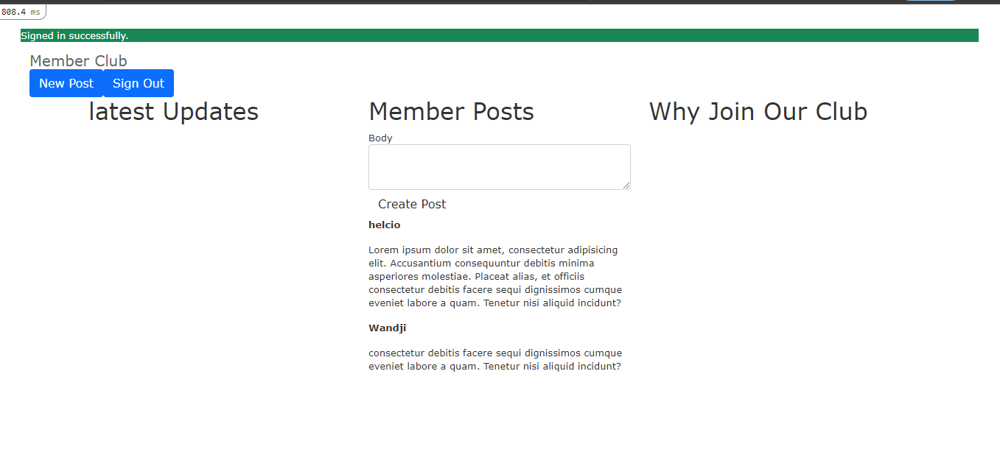
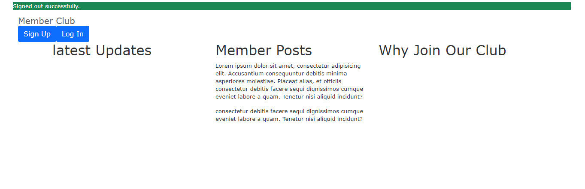

# Members-only

This project is based on building an exclusive clubhouse where members can write anonymous posts. Inside the clubhouse, members can see who the author of a post is but, outside, they can only see the story and wonder who wrote it.

**Member logged in view**

**Member logged out view**

## Members-only project features:

- Member can log in and create a post
- Anyone can see posts but not post author name
- Logged in Members can see post creator name

## Built With

- Ruby on Rails
- Bootstrap
- simple_form
- devise

## Getting Started

### Prerequisites

If you intend to download the project, you will need to have Ruby and Rails already installed on your local machine.

- For more information on how to install Ruby, follow [this link.](https://www.ruby-lang.org/en/downloads/)
- For more information on how to install Rails, follow [this link.](https://guides.rubyonrails.org/getting_started.html/)

## Getting Started

### Setup
1. Run `git clone git@github.com:helciodev/members_only.git` => to clone the source code
2. Run `cd members-only` => to change directory
3. Run `bundle install` => to install all of the gems
4. Run `rails db:migrate` to migrate all tables
5. Run `rails s` => to start the server
6. Open `localhost:3000` on a browser of your choice
## Authors

😎 **Helcio André**

- GitHub: [@helciodev](https://github.com/helciodev)
- Twitter: [@helcio_bruno](https://twitter.com/helcio_bruno)
- Linkedin: [Helcio Andre](https://www.linkedin.com/in/helcio-andre/)

👤 **Wandji Bertrand**

- GitHub: [@wandji20](https://github.com/wandji20)
- LinkedIn: [Wandji Bertrand](https://www.linkedin.com/in/wandji-bertrand/)

## 🤝 Contributing

Contributions, issues and feature requests are welcome!

Feel free to check the [issues page](https://github.com/helciodev/micro-reddit-repo/issues).

## Show your support

Give a ⭐️ if you like this project!

## 📝 License

This project is [MIT](/license.txt) licensed.
